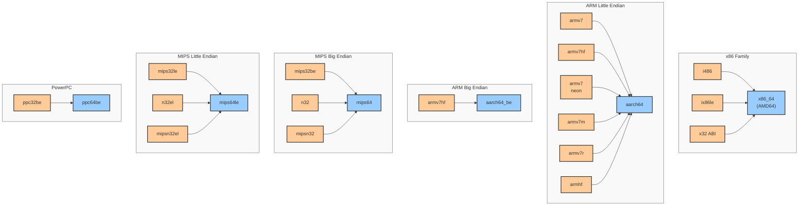

# Architecture Guide

Sthenos supports 50+ architectures for cross-compilation of static debugging tools.

## Supported Architectures

### ARM Architectures
- **aarch64** - ARM 64-bit (ARMv8-A)
- **aarch64_be** - ARM 64-bit big-endian
- **arm32v5le** - ARMv5 little-endian, soft-float
- **arm32v5lehf** - ARMv5 little-endian, hard-float  
- **arm32v7le** - ARMv7 little-endian, soft-float
- **arm32v7lehf** - ARMv7 little-endian, hard-float
- **arm32v7neon** - ARMv7 with NEON SIMD
- **armeb** - ARM big-endian, soft-float
- **armebhf** - ARM big-endian, hard-float
- **armebv7hf** - ARMv7 big-endian, hard-float
- **armel** - ARM EABI little-endian, soft-float
- **armelhf** - ARM EABI little-endian, hard-float  
- **armv5l** - ARMv5 little-endian (legacy naming)
- **armv5lhf** - ARMv5 little-endian, hard-float (legacy naming)
- **armv6** - ARMv6 (Raspberry Pi 1, Pi Zero)
- **armv6sf** - ARMv6 soft-float
- **armv7m** - ARMv7-M (Cortex-M)
- **armv7r** - ARMv7-R (Real-time)

### x86 Architectures
- **x86_64** - 64-bit x86 (AMD64, Intel 64)
- **x86_64_x32** - x86-64 with x32 ABI
- **i486** - 32-bit x86, i486 compatible
- **ix86le** - 32-bit x86 little-endian

### MIPS Architectures
- **mips32be** - MIPS32 big-endian, hard-float
- **mips32le** - MIPS32 little-endian, hard-float
- **mips32besf** - MIPS32 big-endian, soft-float
- **mips32lesf** - MIPS32 little-endian, soft-float
- **mips64** - MIPS64 big-endian
- **mips64le** - MIPS64 little-endian
- **mips64n32** - MIPS64 N32 ABI big-endian
- **mips64n32el** - MIPS64 N32 ABI little-endian
- **mipsn32** - MIPS N32 ABI big-endian
- **mipsn32el** - MIPS N32 ABI little-endian

### PowerPC Architectures  
- **ppc32be** - PowerPC 32-bit big-endian, hard-float
- **ppc32besf** - PowerPC 32-bit big-endian, soft-float
- **ppc32le** - PowerPC 32-bit little-endian, hard-float
- **ppc32lesf** - PowerPC 32-bit little-endian, soft-float
- **ppc64be** - PowerPC 64-bit big-endian
- **ppc64le** - PowerPC 64-bit little-endian

### RISC-V Architectures
- **riscv32** - RISC-V 32-bit
- **riscv64** - RISC-V 64-bit

### Other Architectures
- **arcle_hs38** - Synopsys ARC HS38 little-endian
- **loongarch64** - LoongArch 64-bit
- **m68k** - Motorola 68000 series
- **m68k_coldfire** - Motorola ColdFire
- **microblaze** - Xilinx MicroBlaze big-endian
- **microblazeel** - Xilinx MicroBlaze little-endian  
- **nios2** - Altera Nios II
- **or1k** - OpenRISC 1000
- **s390x** - IBM System/390 64-bit
- **sh2** - SuperH SH-2
- **sh2eb** - SuperH SH-2 big-endian
- **sh4** - SuperH SH-4
- **sh4eb** - SuperH SH-4 big-endian
- **sparc64** - SPARC 64-bit

## Architecture Selection Guide

### Architecture Detection

```bash
# Detect target architecture
arch=$(uname -m)
libc=$(ldd --version 2>&1 | grep -qi musl && echo musl || echo glibc)  
echo "Detected: $arch/$libc"
```

### Identifying Your Architecture

Use the `file` command on any system binary to identify your architecture:

```bash
$ file /bin/busybox
/bin/busybox: ELF 32-bit LSB executable, MIPS, MIPS32 version 1 (SYSV), dynamically linked...
# → Use: mips32le (little-endian) or mips32lesf (if no FPU)

$ file /bin/ls
/bin/ls: ELF 32-bit LSB executable, ARM, EABI5 version 1 (SYSV), dynamically linked...
# → Use: arm32v7le or arm32v5le depending on ARM version

$ file /bin/sh
/bin/sh: ELF 64-bit LSB executable, x86-64, version 1 (SYSV), dynamically linked...
# → Use: x86_64

$ file /bin/cat
/bin/cat: ELF 32-bit MSB executable, PowerPC or cisco 4500, version 1 (SYSV)...
# → Use: ppc32be (big-endian)

$ file /bin/echo  
/bin/echo: ELF 64-bit LSB executable, ARM aarch64, version 1 (SYSV)...
# → Use: aarch64
```

### Key Indicators

- **ELF 32-bit LSB** = Little-endian, 32-bit
- **ELF 32-bit MSB** = Big-endian, 32-bit  
- **ELF 64-bit** = 64-bit architecture
- **MIPS32** = Use mips32le/be variants
- **ARM EABI5** = ARMv5 or higher
- **ARM aarch64** = 64-bit ARM
- **x86-64** = Standard x64/AMD64

### Floating-Point Considerations

**Hard-float (HF)** architectures require hardware FPU:
- Faster floating-point operations
- Smaller code size for FP-heavy applications
- Only works on systems with FPU hardware

**Soft-float (SF)** architectures emulate floating-point:
- Works on systems without FPU
- Larger code size, slower FP operations  
- Maximum compatibility

**When in doubt, use soft-float variants** for embedded systems.

## Build Support Matrix

| Tool | ARM | x86 | MIPS | PowerPC | RISC-V | Other |
|------|-----|-----|------|---------|---------|--------|
| strace | ✅ | ✅ | ✅ | ✅ | ✅ | ✅ |
| busybox | ✅ | ✅ | ✅ | ✅ | ✅ | ✅ |
| bash | ✅ | ✅ | ✅ | ✅ | ✅ | ✅ |
| socat | ✅ | ✅ | ✅ | ✅ | ✅ | ✅ |
| ply | ✅ | ✅ | ❌ | ❌ | ❌ | ❌ |
| ltrace | ✅ | ✅ | ✅ | ✅ | ❓ | ❓ |

*✅ = Fully supported, ❌ = Not supported, ❓ = Untested*

**Note**: ply only supports ARM and x86 architectures due to kernel BPF limitations.

## Binary Compatibility

The following diagram shows which architectures can run binaries compiled for other architectures (upward compatibility):



### Compatibility Notes

- **x86 Family**: Has the strongest backward compatibility. x86_64 systems can run 32-bit x86 binaries (i486, ix86le)
- **ARM Family**: Only ARMv7 binaries are compatible with ARMv8/aarch64. ARMv5/v6 binaries are NOT compatible
- **MIPS Family**: Strict endianness matching required. Soft-float variants are NOT compatible with hard-float systems
- **PowerPC Family**: Only hard-float big-endian variants have compatibility path
- **RISC-V**: No backward compatibility between riscv32 and riscv64
- **Soft-float variants**: Generally NOT compatible with hard-float systems

## Legacy Architecture Names

Some architectures have legacy names that map to canonical names:

| Legacy Name | Canonical Name | Notes |
|-------------|----------------|-------|
| armv5 | arm32v5le | Old naming |
| mips32 | mips32be | MIPS big-endian |
| mips32el | mips32le | MIPS little-endian |
| ppc32 | ppc32be | PowerPC big-endian |
| openrisc | or1k | OpenRISC |
| aarch64be | aarch64_be | ARM64 big-endian |